# Reconsidering "Reconsidering Custom Memory Allocation"

[Nicolas van Kempen](https://nvankempen.com/), [Emery D. Berger](https://emeryberger.com/)

In this work, we revisit the [_Reconsidering Custom Memory Allocation_ paper](docs/berger-oopsla2002.pdf)[^1]. That
widely-cited paper (selected as a Most Influential Paper[^2]) conducted a study that demonstrated that in many cases,
custom memory allocators often do not provide significant performance benefits over a good general-purpose memory
allocator.

That paper compared the original programs (with custom allocators) with versions that used general-purpose allocators
(either directly or via a "shim" that redirected individual object allocations to `malloc`/`free`). However, their
approach started with a clean-slate heap (no prior allocations); this does not account for the case of long-running
applications, where heap fragmentation is inevitable. We show that, for fragmented heaps, custom memory allocators can
significantly outperform modern general-purpose allocators.

## Littering

To simulate the effect of long-running execution on the heap, we present a novel methodology we call _littering_.
Littering allows us to measure the benefits of custom allocators without unfairly favoring `malloc`/`free`. Unlike
starting from a clean-slate heap, littering simulates the conditions of a long-running program, where fragmentation is
inevitable. Littering works by first running a short pre-conditioning step before starting the program, allocating and
freeing objects.

More precisely, littering works in two phases:
 1. **Detection:** We run the program as usual, but with a _detector_ library (`LD_PRELOAD=libdetector.so <program>`)
    that keeps track of every allocated object's size, binning sizes to obtain a rough size distribution of the objects
    used by the program, which it produces as output to be consumed in the littering phase. Detector also keeps track of
    several allocation statistics, including mean, min/max, and most importantly, `MaxLiveAllocations`.

As an example, here is the size class distribution recorded by the detector for `boxed-sim`.

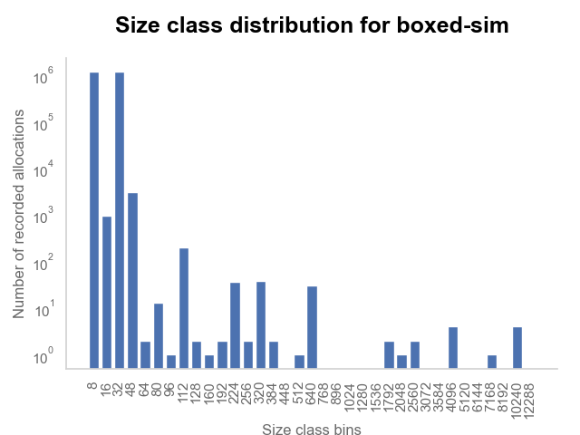

2. **Littering:** With the statistics and histogram in hand, we next run littering
    (`LD_PRELOAD=liblitterer.so <program>`). Littering allocates `LITTER_MULTIPLIER * MaxLiveAllocations` objects
    following the recorded size distribution, (optionally) shuffling the addresses of allocated objects, and frees a
    fraction of `1 - LITTER_OCCUPANCY` of them. We use the same `malloc` as the program, so the program starts with the
    heap in a littered state. There are a few tunable parameters, which can be provided as environment variables:
     -  `LITTER_SEED`: Seed to be used for the random number generator. Random by default.
     -  `LITTER_OCCUPANCY`: Fraction of objects to _keep_ on the heap. Value must be between 0 and 1.
     -  `LITTER_NO_SHUFFLE`: Set to 1 to disable shuffling, and free from the last allocated objects.
     -  `LITTER_SLEEP`: Sleep _x_ seconds after littering, but before starting the program. Default is disabled.
     -  `LITTER_MULTIPLIER`: Multiplier of number of objects to allocate. Default is 20.

The diagram below shows in a simple way the effect of littering on the heap. With a blank, fresh heap, the allocator is
usually able to pack allocations in contiguous memory, yielding much better locality and cache performance throughout
the program. Fragmentation however, either natural or artificial with littering, forces the allocator to return
non-contiguous addresses to successive allocations. This tends to degrade performance.

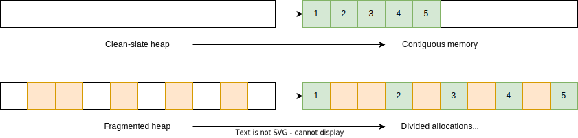

## Experimental Platform

All data was obtained on a Thinkpad P15s Gen 2 with an Intel i7-1165G7 processor. All results below were obtained with
`LITTER_MULTIPLIER = 1`, varying the occupancy number. A multiplier of 1 is approximately equivalent to letting the
program run once, keeping a random fraction of the objects it allocated on the heap, and running it again.

## Benchmarks

We evaluate littering on the four benchmarks from the original paper we were able to obtain and run.

| Benchmark    | Custom allocation method | Description                                     | Input             |
|--------------|--------------------------|-------------------------------------------------|-------------------|
| `197.parser` | region                   | English sentence parser from SPEC2000           | `ref.in`          |
| `boxed-sim`  | freelist                 | Polyhedral approximated balls bouncing in a box | `-n 31 -s 311317` |
| `mudlle`     | region                   | MUD interpreter                                 | `time.mud`        |
| `175.vpr`    | region                   | FPGA placement & routing                        | train placement   |

Notice that as we run on modern hardware, a number of these benchmarks run very quickly. When possible, we increase the
input size so benchmarks run longer, allowing us to provide more accurate measurements. We were not able to increase
mudlle's input, with the benchmark taking typically less than a second.

## Results

We present a series of graphs for each benchmark, using the following versions of glibc (the Linux default allocator),
jemalloc, and mimalloc.

|          | Version |
|----------|---------|
| glibc    | 2.31    |
| jemalloc | 5.3.0   |
| mimalloc | 2.0.6   |

For each benchmark, the elapsed time graph is normalized to the elapsed time of the original program (running with its
custom allocator), without littering. We also generate graphs separating events counted with `perf`. We assign events
inside or outside of `malloc`/`free` based on which shared object (library) the sample comes from (e.g.,
`libjemalloc.so`).

### `197.parser`

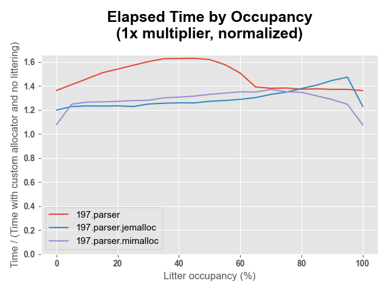
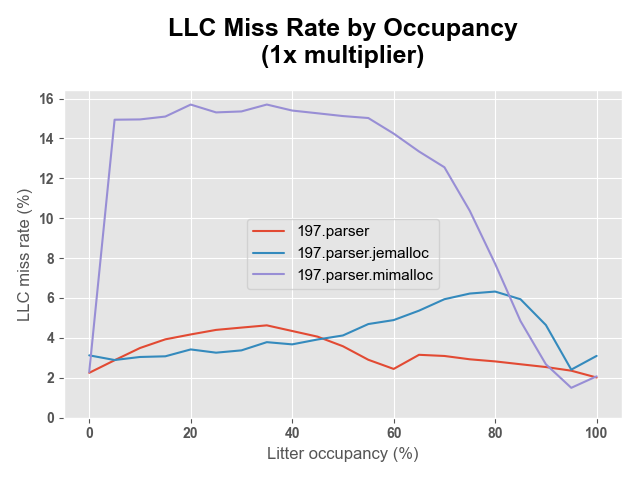
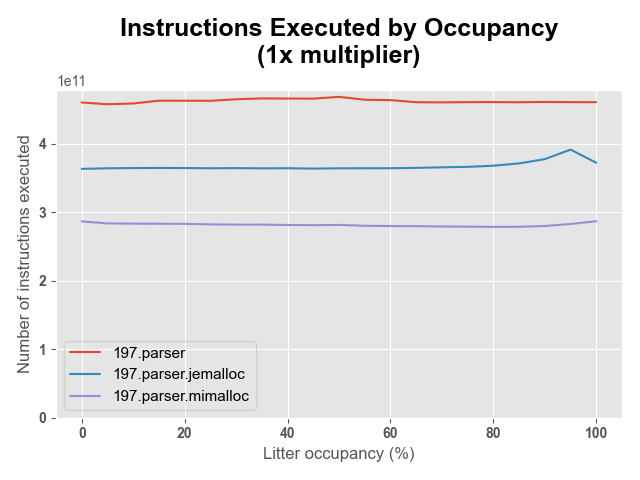
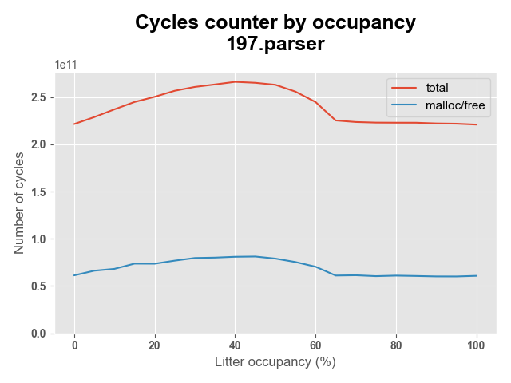
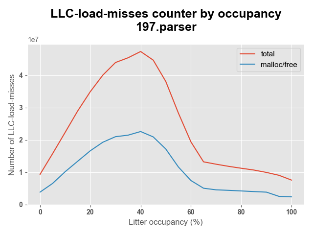
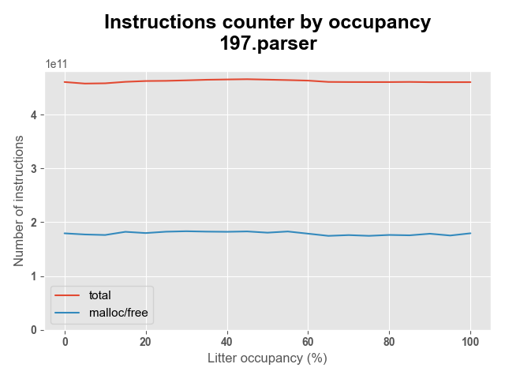

### `boxed-sim`

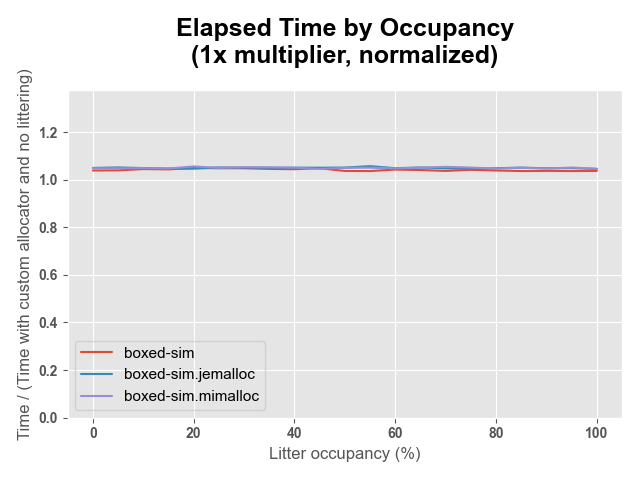
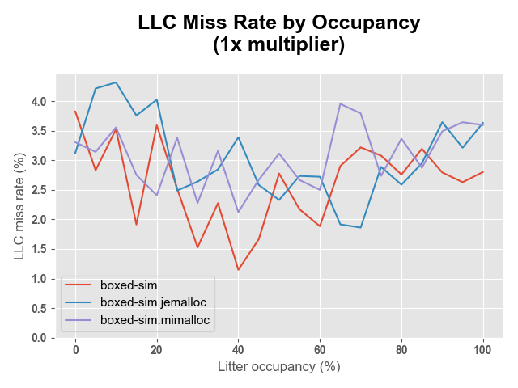
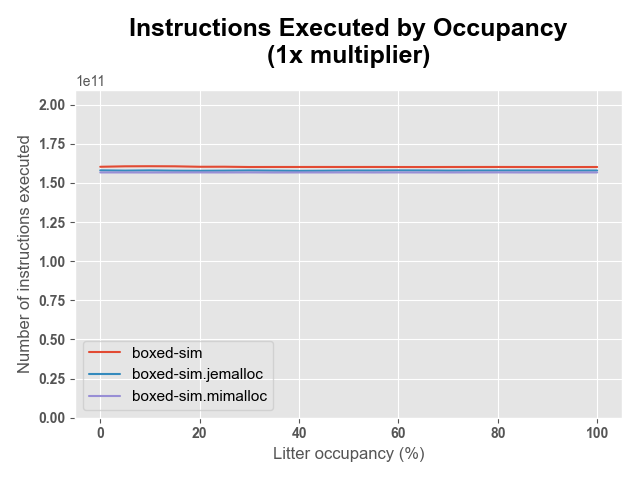

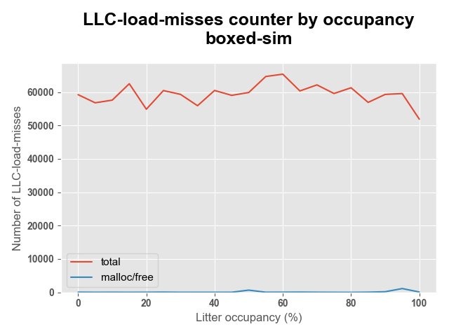
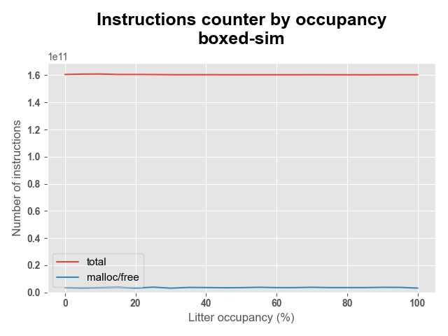

### `mudlle`

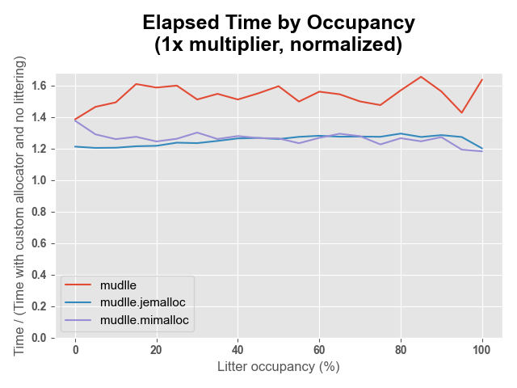
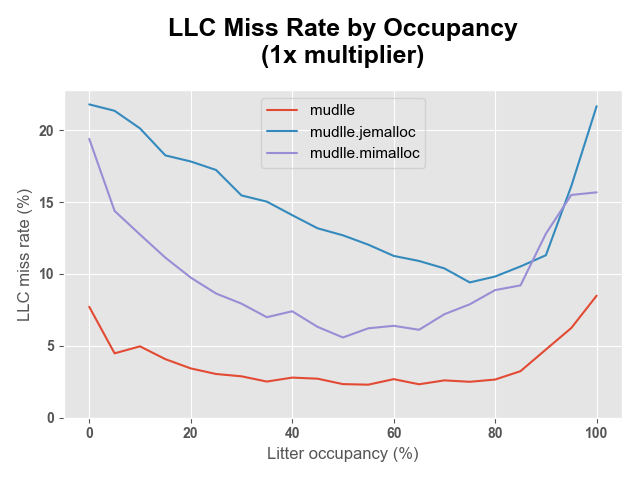
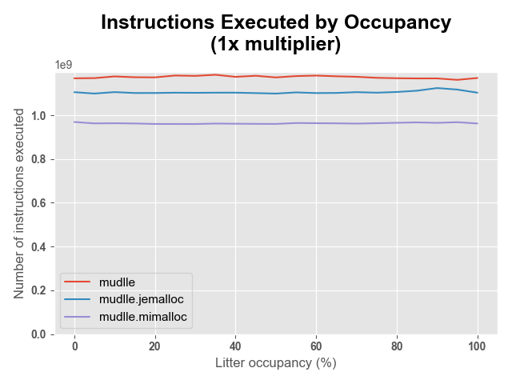
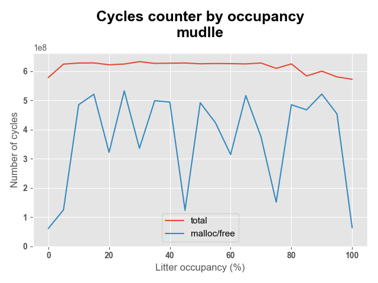
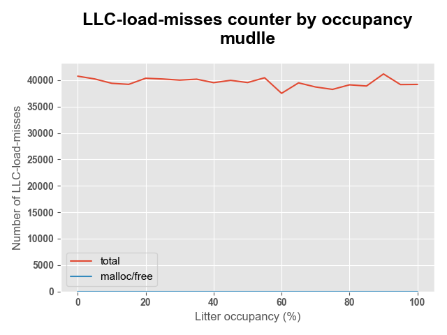
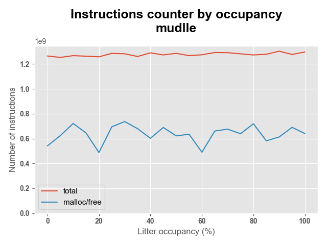

### `175.vpr`

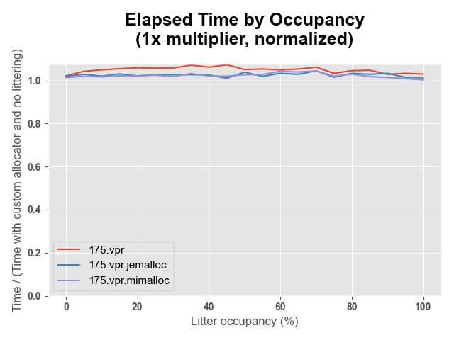
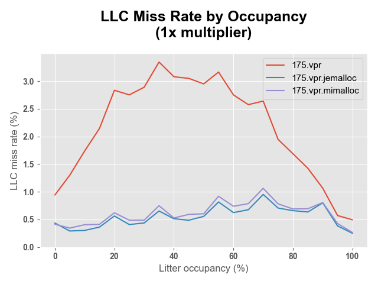
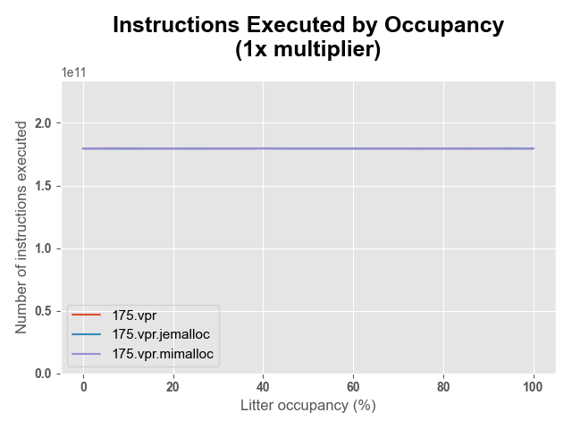
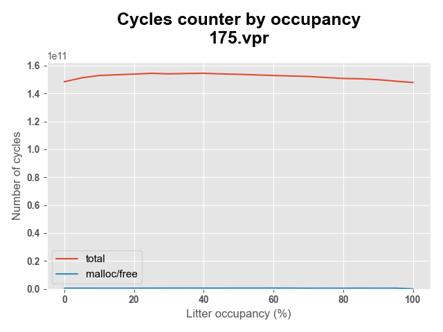
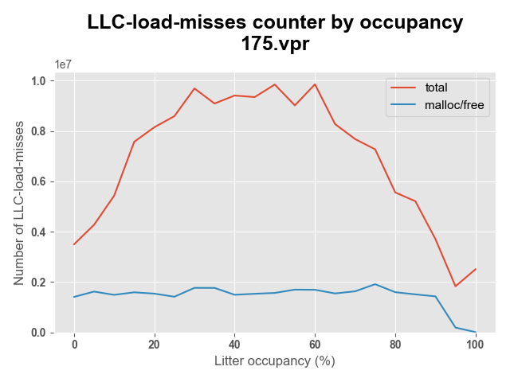
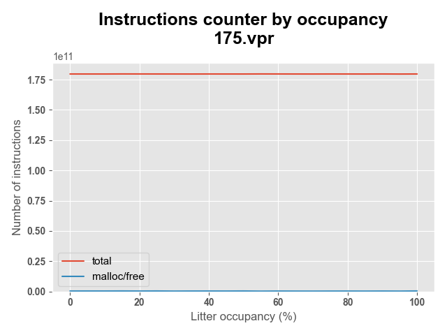

[^1]: Emery D. Berger, Benjamin G. Zorn, and Kathryn S. McKinley. 2002. Reconsidering custom memory allocation. In Proceedings of the 17th ACM SIGPLAN conference on Object-oriented programming, systems, languages, and applications (OOPSLA '02). Association for Computing Machinery, New York, NY, USA, 1–12. https://doi.org/10.1145/582419.582421
[^2]: Most Influential OOPSLA Paper Award. https://www.sigplan.org/Awards/OOPSLA
